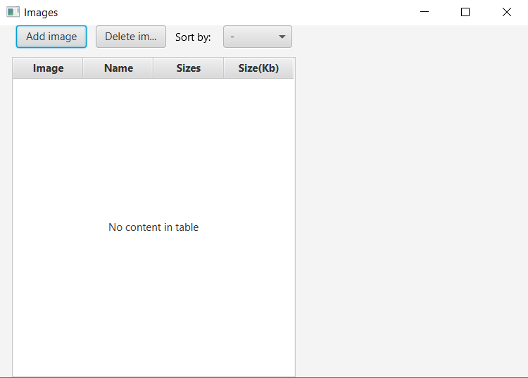
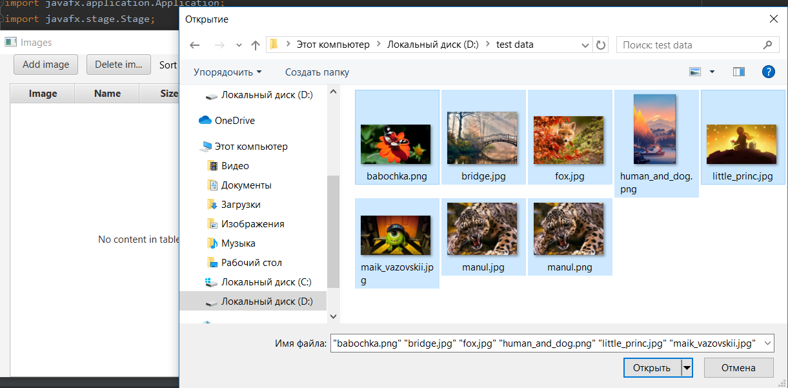
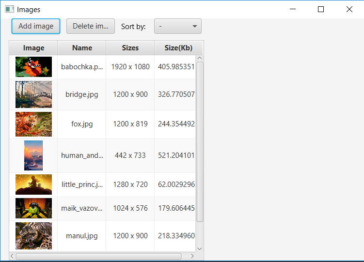
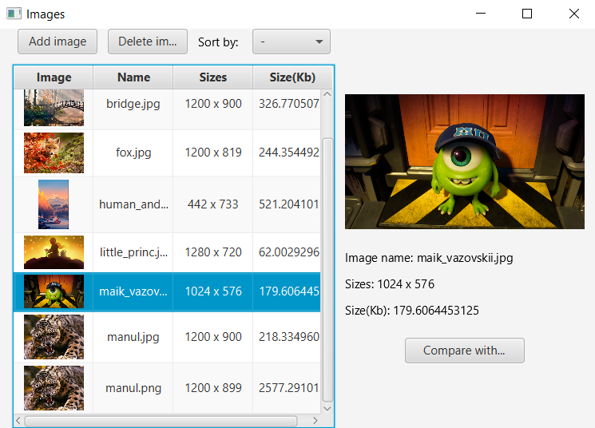
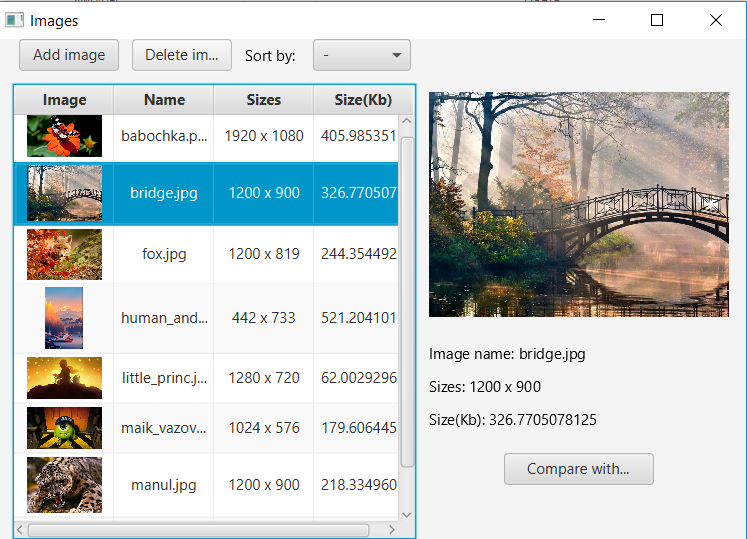
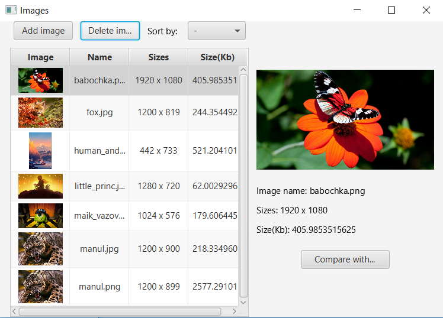
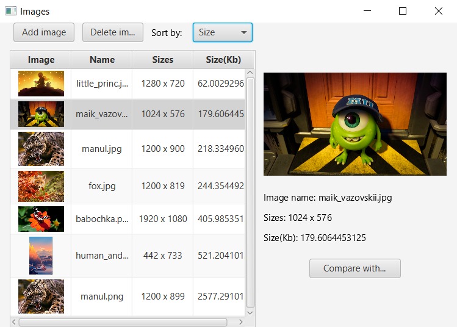
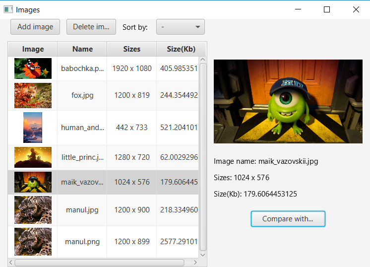
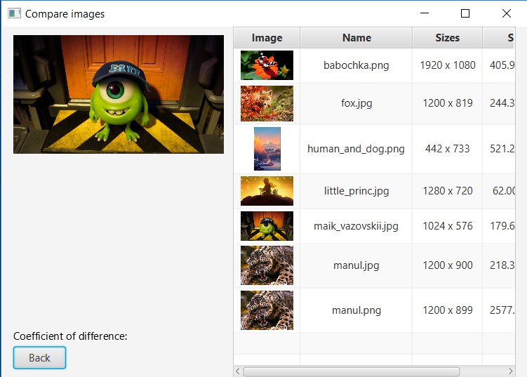

# Проект сортировки картинок
### Сортирует картинки и считает коэффициент разности двух картинок.
* Внешний вид(при запуске приложения):  
  
### Функции:
`Добавление картинки`:  
Можно добавить сразу несколько картинок.

  
  

`Увеление выбранной картинки`:  
  

`Удаление картинки`:  
Удалить картинку можно только одну, выделенную.
  

`Сортировка картинок`:  
У таблицы есть встроенная сортировка для каждого столбца(стоит только дважды кликнуть на нужный столбец).
Вверху я добавила свою сортировку, чтобы показать свои.  
* Есть сортировка по имени:  
  
* Есть сортировка по размеру файла(Кб):  
  

`Сравнение картинок`:  
  

  

Сравнение картинок осуществляется поиском среднеквадратического отклонения пикселей одного изображения от другого.  
Перед сравнением картинки приводятся к одному размеру 32х32. 
 
